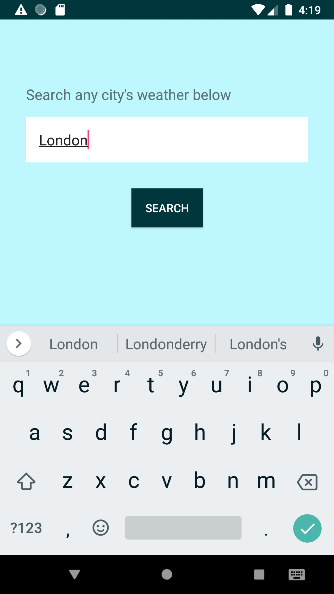

# demo-weather-app
This project contains a demo implementation fetching data from [https://openweathermap.org/api](https://openweathermap.org/api)

This app contains 1 screen:
- Landing screen


**Test Coverage:** ViewModels, DataManager

#### Technologies and arch used
- MVVM
- Retrofit
- Kotlin
- Koin
- RxJava
- Testing: Robolectric, Mockito


#### Possible new features / improvements
1- Add drawable at the start of weather fields
``` 
android:drawableStart="@drawable/ic_rain"
``` 

2- Show found city in map: Using google maps to display returned coordinates from server:
- Given coordinates returned by server: 
``` 
"coord": {
        "lon": -3.7,
        "lat": 40.42
}
```
- Use them to display a marker in map:
```
val marker: MarkerOptions = MarkerOptions().position(LatLng(lat, longt)).title("Found");
googleMap.addMarker(marker);
```

3- Allow saving result to favourites: 
- Create a database with room: I'd store only some fields from the weather object. There's no point on saving temporary data as temperature. Theres 2 options: using @Ignore annotation for room not to use some fields o creating a business object model with less data.
```
// Update business object
@Entity(tableName = TABLE_WEATHER_FAV)
data class Weather(

//create a dao
@Dao
interface WeatherFavDao {}

// create databse
@Database(entities = [Weather::class], version = 1, exportSchema = true)
abstract class AppDatabase : RoomDatabase() {
    abstract fun weatherFavDao(): WeatherFavDao
}

// create databse module for koin
val DatabaseModule = module {

    val appDatabase: AppDatabase = Room.databaseBuilder(KoinContextHandler.get().get(), AppDatabase::class.java, "weather_db")
            .fallbackToDestructiveMigration()
            .build()

    single { appDatabase.weatherFavDao() }
}

// add module to loadKoinModules

```
- Add favourite icon(ImageView or button) to layout
- Add listener to icon connecting to viewmodel and updating filling of icon
- viemodel will call datamanager to store(or delete) result to database
- data manager will have access to weatherFavDao the one that will interact with db

4- Add button or navigation drawer so user can see how is the weather like in favourite locations

5- List of favourite locations and their weather. Datamanger should be able fetch this data by calling database and server.

5- Handle connectivy issues by detecting connection changes - see an example of it in any of my projects like https://github.com/nanav/marvel-test


